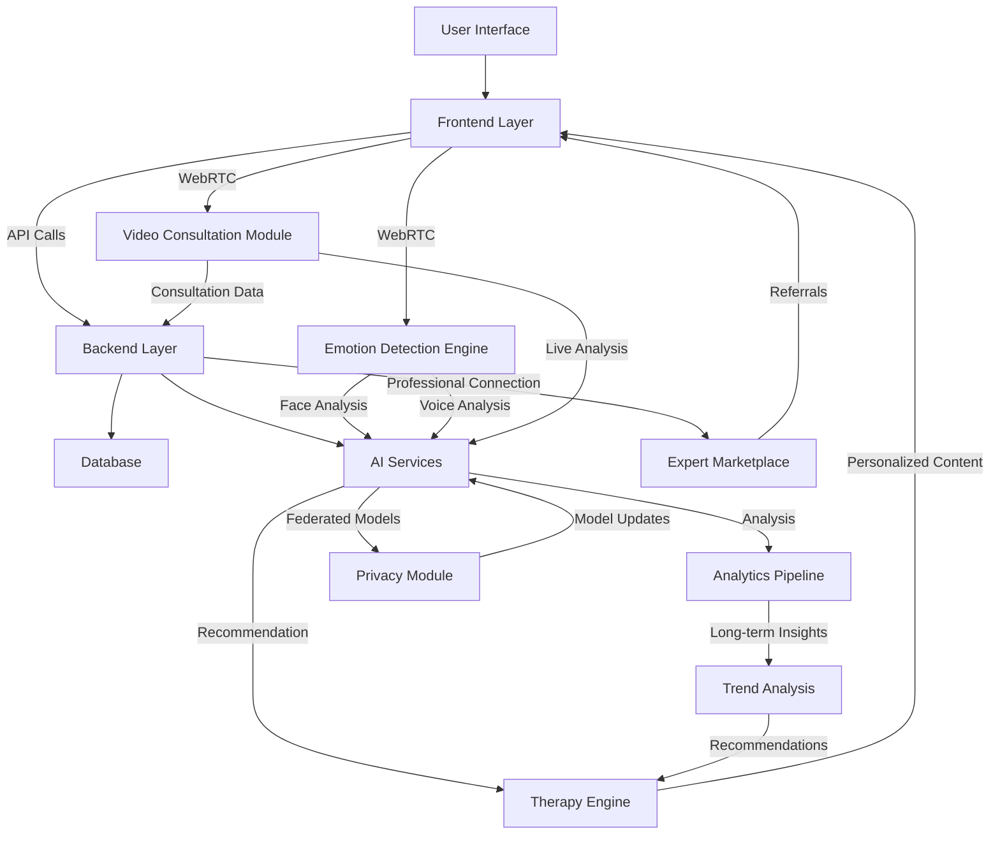

# ThriveAI AMI UI

<div align="center">
  
  
  
  <p align="center">
    <a href="#key-features"></a>
    <a href="#system-requirements"></a>
    <a href="#technologies"></a>
    <a href="#system-architecture"></a>
    <a href="#technologies"></a>
    <a href="#ai-technology"></a>
    <a href="#security-and-privacy"></a>
  </p>

  <h3 align="center">The First Intelligent Mental Health Support Platform Powered by Multimodal AI Technology</h3>
  
  <p align="center">
    <a href="#demo"><strong>View Demo »</strong></a>
    <span> · </span>
    <a href="#installation"><strong>Get Started »</strong></a>
    <span> · </span>
    <a href="#key-features"><strong>Features »</strong></a>
    <span> · </span>
    <a href="#contributing"><strong>Contribute »</strong></a>
  </p>
</div>

<div align="center" style="border-radius:10px; border: 1px solid #0078ff; background-color: rgba(0, 120, 255, 0.05); padding: 20px; margin: 20px 0;">
  <p style="font-style: italic; font-size: 1.1em;">
    ThriveAI AMI UI is a comprehensive mental health solution that combines multimodal artificial intelligence with emotion tracking tools and personalized therapy approaches, empowering users to enhance their quality of life in a proactive and scientific way.
  </p>
</div>

## 📊 Overview

ThriveAI AMI UI is a next-generation mental health care platform that integrates cutting-edge AI technology to identify, analyze, and improve users' emotional states. The project combines multimodal analysis (facial, voice, text) with personalized therapies based on various modern psychological approaches.

Developed by a team of AI engineers and psychology experts, ThriveAI AMI UI is not just an emotion monitoring tool but a companion on the journey to improved mental health.

<div align="center">
  
  <p><i>Intuitive Dashboard Interface</i></p>
</div>

## ✨ Key Features

### 🧠 Multimodal Emotion Analysis

Our advanced emotion recognition system uses multiple data channels to provide a comprehensive understanding of emotional states:

- **Facial Recognition:** Detects 13 detailed emotions through camera with high accuracy
  - Utilizes 68 facial landmarks for precise micro-expression analysis
  - Real-time processing with custom YOLOv8 model
  - Tracks continuous emotional sequences throughout sessions
- **Voice Analysis:** Identifies emotions from tone, speed, and intonation
  - Employs Wav2Vec 2.0 model for audio sentiment analysis
  - Captures subconscious emotional markers in speech patterns
  - Supports 15+ languages with dialect awareness
- **Text Analysis:** Understands and evaluates emotions from user journals
  - Deep semantic analysis using multilingual transformer models
  - Identifies latent emotional patterns in written content
  - Tracks emotional changes over time in journal entries
- **Multimodal AI Integration:** Combines data sources for comprehensive assessment

  - Cross-validates emotions across different modalities
  - Weighs contradictory signals based on context and reliability
  - Provides holistic emotional state mapping beyond single-channel analysis

- **Feedback Loop:** Self-improves accuracy over time based on user feedback
  - Personalizes emotion detection thresholds to individual expressions
  - Adapts to cultural and individual emotional expression differences
  - Builds personalized emotional baseline for more accurate tracking

### 🌱 Personalized Psychological Therapy

Our personalized approach to mental health support adapts to your unique needs:

- **Intelligent CBT:** Cognitive Behavioral Therapy exercises that automatically adjust
  - Identifies cognitive distortions unique to your thought patterns
  - Provides targeted challenges to negative thought cycles
  - Adapts difficulty based on progress and emotional state
  - Incorporates evidence-based CBT protocols with AI enhancements
- **Guided Meditation:** Meditation and mindfulness practices customized to your current state
  - Dynamic session length (3-30 minutes) based on user needs
  - Binaural beats and custom soundscapes for enhanced focus
  - Breathing visualization tools with adaptive guidance
  - Progressive pathways from beginner to advanced practices
- **Virtual Specialist:** Chat with AI trained by psychology experts
  - Knowledge base built with clinical psychologists' expertise
  - Employs therapeutic conversation techniques like active listening
  - Recognizes crisis signals and provides appropriate responses
  - Maintains continuity across sessions for ongoing support
- **Development Roadmap:** Long-term plans that self-adjust according to user progress
  - Creates customized mental wellness programs spanning weeks/months
  - Adjusts goals and exercises based on adherence and progress
  - Identifies pattern disruptions and provides path corrections
  - Celebrates milestones with evidence-based reinforcement
- **Expert Connection:** Suggestion to consult specialists when necessary
  - AI-powered triage system for professional referral decisions
  - Seamless handoff to human professionals when needed
  - Follow-up integration after professional consultations
  - Directory of verified mental health practitioners

### 🎥 Real-time Video Consultation with AI

Our innovative AI video consultation system provides face-to-face therapeutic interactions:

- **Live AI Therapist:** Real-time video sessions with advanced therapeutic AI
  - Facial expression responsive AI that adapts to emotional cues
  - Natural conversation flow with minimal latency
  - Session recording with automated emotional analysis report
  - Private end-to-end encrypted video connection
- **Immersive Experience:** High-quality audiovisual interface designed for therapeutic comfort
  - Calming visual environment with customizable themes
  - Background noise reduction and voice enhancement
  - Adjustable session duration from quick check-ins to full sessions
  - Accessibility features including captions and visual adaptations
- **Session Continuity:** AI remembers previous interactions for coherent therapy progression

  - Session history analysis for tracking therapeutic progress
  - Connection with journal entries and emotion tracking data
  - Homework assignment and review in follow-up sessions
  - Seamless transition between text chat and video formats

- **Crisis Support:** 24/7 availability for urgent mental health needs
  - Immediate access during emotional difficulties
  - Escalation protocols for severe situations
  - Guided grounding techniques for anxiety and panic
  - Optional emergency contact integration

### 📊 Data Analysis & Monitoring

Comprehensive analytics provide insights into your emotional patterns:

- **Trend Reports:** Long-term emotional trend analysis with intuitive charts

  - Weekly, monthly, and quarterly emotional pattern visualization
  - Correlation mapping between activities and emotional states
  - Comparison with baseline measurements to track progress
  - Customizable reporting periods and metrics

- **Crisis Prediction:** Early detection of potential abnormal warning signs

  - Anomaly detection algorithms to identify concerning patterns
  - Predictive analysis based on historical emotional data
  - Pre-crisis intervention suggestions with timing optimization
  - Risk level assessment with transparent reasoning

- **Biological Correlation:** Integration with health data from wearable devices

  - Heart rate variability (HRV) correlation with emotional states
  - Sleep quality analysis in relation to mental wellbeing
  - Physical activity impact on mood patterns
  - Comprehensive mind-body connection visualization

- **Smart Notifications:** Suggestions for intervention at crucial moments

  - Context-aware timing to maximize effectiveness
  - Non-intrusive delivery methods customized to user preference
  - Actionable micro-interventions within notifications
  - Reinforcement of positive patterns through timely recognition

- **Expert Reports:** Export appropriate data for consultation specialists
  - Clinical-grade reporting formats compatible with healthcare systems
  - Selective data sharing with customizable privacy controls
  - Historical comparison views for tracking treatment efficacy
  - Collaboration tools for therapist annotations and planning

### 🔒 Security & Privacy

Protecting your data with the highest standards:

- **E2EE Encryption:** Protecting user data with end-to-end encryption

  - Zero-knowledge architecture preventing unauthorized access
  - Client-side encryption of all sensitive information
  - Secure key management with no server-side storage
  - Regular security audits and penetration testing

- **Federated Learning:** AI models improve without sharing private data

  - On-device model training maintaining data sovereignty
  - Differential privacy implementation for aggregated improvements
  - Anonymized model parameter updates only
  - Transparency controls for AI learning opt-in/out

- **Local Data Processing:** Emotion analysis directly on user devices

  - Edge computing for sensitive biometric processing
  - Minimal cloud data transmission requirements
  - Offline functionality for core therapeutic features
  - Transparent data flow visualization for users

- **Data Control:** Users have full authority over stored data

  - Granular permission controls for each data category
  - One-click data export in standard formats
  - Scheduled and on-demand data purging options
  - Comprehensive data lifecycle management

- **GDPR & HIPAA Compliance:** Meeting international health data security standards
  - Regular compliance audits with published results
  - Data processing agreements with all service providers
  - Geographic data residency options for regulatory requirements
  - Clear consent management with revocation capabilities

## 🌈 Advanced Multi-Dimensional Emotion Recognition System

The next-generation emotion recognition system (version 2.0) is the heart of ThriveAI, integrating advanced artificial intelligence technology to detect and analyze emotional states in real-time from multiple data sources.

### 💡 Core Technology

- **Transformer AI:** Models based on transformer architecture for deep understanding of emotional context

  - Specialized attention mechanisms for emotion-relevant features
  - Context-aware processing across time sequences
  - Transfer learning from large language models adapted to emotion domains
  - Multi-head attention for capturing complex emotional nuances

- **Neural Emotion Mapping:** Dynamic neural emotional mapping adjusting to new data

  - Personalized emotion space calibration for individual differences
  - Continuous adaptation to evolving emotional expression
  - Multi-dimensional emotion representation beyond basic categories
  - Cultural and contextual awareness in emotion interpretation

- **Multimodal Fusion:** Intelligent combination of data from face, voice, and text

  - Cross-modal attention mechanisms for coherent integration
  - Weighted confidence scoring across modalities
  - Contradiction resolution through contextual analysis
  - Temporal alignment of signals from different sources

- **Federated Learning:** Improves models without sharing sensitive user data
  - Privacy-preserving model updates via secure aggregation
  - Differential privacy guarantees for contribution anonymity
  - Client-side computation with minimal data transfer
  - Transparent improvement tracking for user trust

### 🎭 Advanced Emotion Map

The system recognizes and analyzes a complex spectrum of emotions with 20 detailed states:

- **Primary Emotions:** Happiness, Sadness, Anger, Fear, Surprise, Disgust
- **Complex States:** Anxiety, Contentment, Frustration, Excitement, Pride, Shame
- **Nuanced Feelings:** Relaxation, Loneliness, Gratitude, Love, Curiosity, Confusion
- **Cognitive-Emotional Blends:** Focus, Fatigue, Enthusiasm, Apathy

Each emotional state is analyzed with intensity levels, duration patterns, and transition tendencies for comprehensive emotional intelligence.

## 🛠️ Technologies

### Frontend

- **Next.js 13:** React framework with SSR/SSG and API routes

  - App Router architecture for optimized navigation
  - Server Components for improved performance
  - Streaming responses for better user experience

- **React 18:** UI library with Concurrent Mode

  - Suspense for data fetching with fallback states
  - Automatic batching for improved performance
  - Concurrent rendering for responsive interfaces

- **TailwindCSS:** Utility-first CSS framework

  - Custom design system implementation
  - Responsive design across all device sizes
  - Dark/light mode with automatic preference detection

- **ThreeJS:** Immersive 3D visualization

  - Interactive 3D emotion mapping
  - WebGL-accelerated visualizations
  - Responsive performance optimization

- **Framer Motion:** Animation and transitions

  - Emotion-responsive animation patterns
  - Physics-based interactions
  - Accessibility-compliant motion design

- **Additional Technologies:**
  - ReCharts: Data visualization
  - i18n: Multilingual support
  - PWA: Native-like application experience
  - WebRTC: Direct camera and audio processing

### Backend

- **FastAPI:** High-performance API with asyncio

  - Asynchronous endpoint handling for scale
  - Automatic OpenAPI documentation
  - Type validation and data serialization

- **Python 3.10+:** Supporting latest features

  - Type hints throughout codebase
  - Asyncio for concurrent operations
  - Modern syntax optimizations

- **GraphQL:** Flexible API with Apollo

  - Schema-based type system
  - Efficient data fetching with single requests
  - Real-time subscriptions for updates

- **Additional Technologies:**
  - WebSocket: Real-time connections
  - PostgreSQL: Robust relational database
  - Redis: Caching and message broker
  - JWT: Secure authentication
  - Docker: Easy deployment containerization
  - Kubernetes: Automated container management

### AI Technology

- **YOLO v8:** Real-time face detection

  - Custom-trained model for emotion features
  - Optimized for mobile and low-power devices
  - High-frequency tracking for micro-expressions

- **Transformer:** Advanced language analysis models

  - Fine-tuned for therapeutic conversation
  - Multilingual emotion understanding
  - Context-aware response generation

- **Wav2Vec 2.0:** Audio and voice analysis

  - Emotion detection from vocal characteristics
  - Speaker-independent performance
  - Noise-robust processing

- **Additional Technologies:**
  - Multimodal Models: Combining analysis of multiple data types
  - TensorFlow/PyTorch: Deep learning frameworks
  - ONNX Runtime: Inference optimization
  - WebGL/WebGPU: Browser-based AI processing
  - Federated Learning: Privacy-preserving distributed learning
  - Gemini Pro API: Advanced language model integration

### DevOps & Security

- **CI/CD:** GitHub Actions automation

  - Comprehensive test coverage
  - Automated quality checks
  - Deployment pipeline with staging environments

- **Infrastructure as Code:** Terraform & Ansible

  - Reproducible environment configuration
  - Multi-cloud deployment support
  - Version-controlled infrastructure

- **Additional Technologies:**
  - Monitoring: Grafana & Prometheus
  - End-to-End Encryption: User data protection
  - HIPAA & GDPR Compliance: Meeting health data standards
  - Zero Knowledge Architecture: No sensitive information storage
  - On-device Processing: Local processing when possible
  - Automated Security Testing: SAST/DAST/IAST

## 📊 System Architecture

<div align="center">
  
</div>



## 🧪 Therapeutic Tools

### 💭 AI-Powered CBT Therapy

Personalized cognitive behavioral therapy powered by AI helps users identify and challenge automatic negative thoughts. The system self-adjusts based on user feedback and progress.

**Key Features:**

- Automatic negative thought identification
- Thought challenge suggestions
- Personalized practice exercises
- Long-term progress tracking
- Evidence-based protocol implementation
- Customized difficulty progression
- Integration with emotion tracking data

### 🧘 Mindfulness & Meditation

Guided meditation and mindfulness practices adjusted to the user's current emotional state, with techniques ranging from beginner to advanced.

**Key Features:**

- Diverse guided meditations (3-30 minutes)
- Binaural beats audio
- Guided breathing exercises with visual guidance
- Daily life mindfulness practices
- Progressive skill development path
- State-responsive session recommendations
- Integration with biometric data when available

### 📝 Intelligent Emotion Journal

Emotion journaling system with semantic analysis and smart suggestions, helping users better understand their emotions over time.

**Key Features:**

- Personalized reflection question prompts
- Emotional trend analysis
- Smart reminders
- Multi-media support (text, audio, image)
- Guided journaling templates
- Sentiment analysis feedback
- Connection with therapy modules
- Progress visualization based on journal content

### 🤖 Mental Health Assistant

AI assistant trained by psychology experts supporting users 24/7, providing advice, listening, and offering appropriate coping techniques.

**Key Features:**

- 24/7 supportive conversation
- Crisis coping techniques
- Step-by-step practice guides
- Resource and tool suggestions
- Memory of previous interactions
- Therapeutic technique application
- Seamless handoff to video consultation
- Integration with user's emotional data

### 🎥 Video Consultation AI

Advanced AI-powered video consultation provides face-to-face therapeutic interaction with sophisticated emotional intelligence.

**Key Features:**

- Real-time facial expression analysis
- Natural conversation capabilities
- Session recording and analysis
- End-to-end encrypted connection
- Customizable virtual environment
- Session continuity with previous interactions
- Crisis detection and escalation
- Scheduled and on-demand availability
- Multi-device synchronized sessions

## 🚀 System Requirements

| Component      | Minimum                                       | Recommended                          |
| -------------- | --------------------------------------------- | ------------------------------------ |
| **Node.js**    | ≥ 16.x                                        | 18.x LTS or newer                    |
| **Python**     | ≥ 3.9                                         | 3.10+ with asyncio                   |
| **RAM**        | 4GB                                           | ≥ 8GB for optimal performance        |
| **CPU**        | 4 cores                                       | ≥ 6 cores for smooth AI processing   |
| **GPU**        | Optional                                      | NVIDIA with CUDA for AI acceleration |
| **Webcam**     | 720p                                          | 1080p @ 30fps or higher              |
| **Microphone** | Basic                                         | Good quality with noise cancellation |
| **Storage**    | 2GB                                           | ≥ 5GB + space for data               |
| **OS**         | Windows 10+, macOS Monterey+, Ubuntu 20.04+   | Latest version recommended           |
| **Browser**    | Chrome 90+, Firefox 90+, Safari 15+, Edge 90+ | Chrome 100+ or Edge 100+ recommended |

## 📦 Installation

### 1. Clone the project

```bash
git clone https://github.com/company/thriveai-ami-ui.git
cd thriveai-ami-ui
```

### 2. Install Frontend

```bash
# Using npm
npm install

# Or using yarn
yarn install

# Or using pnpm
pnpm install
```

### 3. Install Backend

```bash
cd backend
python -m venv venv
source venv/bin/activate  # Windows: venv\Scripts\activate
pip install -r requirements.txt
```

### 4. Install AI Engine

```bash
cd ../AI
uvicorn main:app --reload
source venv/bin/activate  # Windows: venv\Scripts\activate
pip install -r requirements.txt
```

### 5. Set up environment variables

```bash
cp .env.example .env
# Update necessary environment variables in the .env file
```

## 🚀 Running the Project

### Start Frontend

```bash
npm run dev
```

### Start Backend API

```bash
cd backend
source venv/bin/activate
python app.py
```

### Start AI Engine

```bash
cd ai-engine
source venv/bin/activate
python engine.py
```

## 📱 Cross-Platform Integration

<div style="display: flex; justify-content: space-between; flex-wrap: wrap; margin-top: 20px;">
  <div style="flex: 1; min-width: 300px; text-align: center; padding: 20px;">
    
    <h3>Web Application</h3>
    <p>Full-featured experience in the browser with responsive design</p>
    <p>Advanced analytics, detailed reporting, and professional interfaces</p>
  </div>
  <div style="flex: 1; min-width: 300px; text-align: center; padding: 20px;">
    
    <h3>Wearable Integration</h3>
    <p>Support for Apple Watch, Fitbit, Garmin, and other popular devices</p>
    <p>Real-time biometric data correlation with emotional states</p>
  </div>
</div>

## 📈 2025 Roadmap

Our development plan for enhancing ThriveAI throughout 2025:

### Q2 2025

- Extended wearables integration with advanced biometrics
- Advanced therapeutic AI with multiple methodologies
- Biometric analysis (HRV, sleep patterns) correlation
- Open API for third-party developers
- Enterprise deployment solutions
- Extended language support

### Q3 2025

- Dedicated supportive social network
- Mental health professional marketplace
- VR/AR immersive therapy environments
- Predictive trend analysis for early intervention
- Family and group therapy features
- Integration with primary healthcare systems

### Q4 2025

- Clinical research studies and results publication
- Integration with health records (EMR/EHR)
- Enterprise platform for organizations
- Voice assistant integration
- Advanced accessibility features
- International regulatory certifications

## 🤝 Contributing

We welcome all contributions! See [CONTRIBUTING.md](CONTRIBUTING.md) for more details.

### Contribution Process

1. Fork the repository
2. Create a new branch: `git checkout -b feature/your-feature-name`
3. Commit changes: `git commit -m 'Add some feature'`
4. Push to your branch: `git push origin feature/your-feature-name`
5. Create a Pull Request

## 📄 License

This project is licensed under the MIT License - see the [LICENSE](LICENSE) file for details.

## 📞 Contact

<div style="display: flex; flex-wrap: wrap; gap: 20px; justify-content: space-around; margin-top: 20px;">
  <div style="border-radius: 10px; border: 1px solid #ddd; padding: 20px; text-align: center; min-width: 200px;">
    <h3>Support & Feedback</h3>
    <p>support@thriveai.example.com</p>
  </div>
  <div style="border-radius: 10px; border: 1px solid #ddd; padding: 20px; text-align: center; min-width: 200px;">
    <h3>Partnerships & Development</h3>
    <p>partnerships@thriveai.example.com</p>
  </div>
  <div style="border-radius: 10px; border: 1px solid #ddd; padding: 20px; text-align: center; min-width: 200px;">
    <h3>Media Inquiries</h3>
    <p>media@thriveai.example.com</p>
  </div>
</div>

---

<div align="center">
  <p>
    <small>© 2025 ThriveAI AMI UI Project. All rights reserved.</small>
  </p>
  <p>
    <a href="#">Home</a> •
    <a href="#">Documentation</a> •
    <a href="#">Report Bug</a> •
    <a href="#">Support</a>
  </p>
</div>
